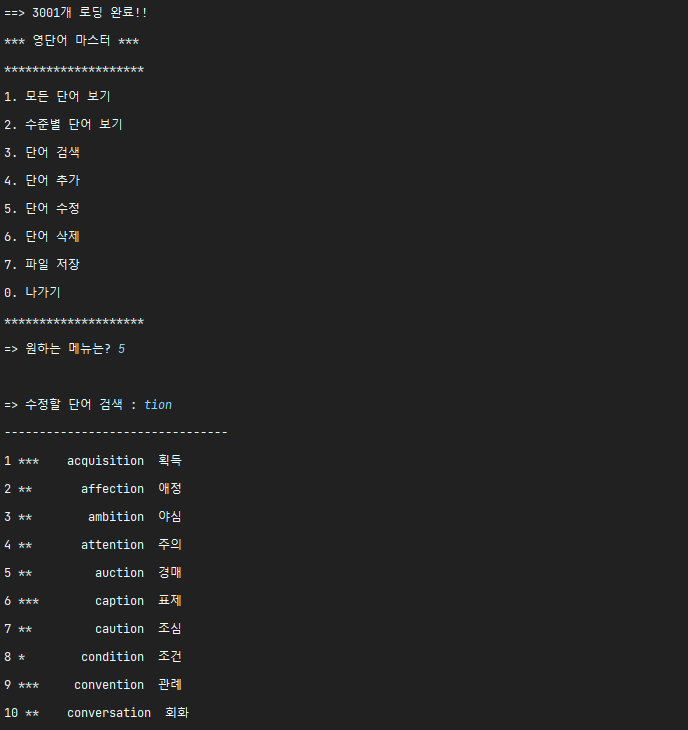
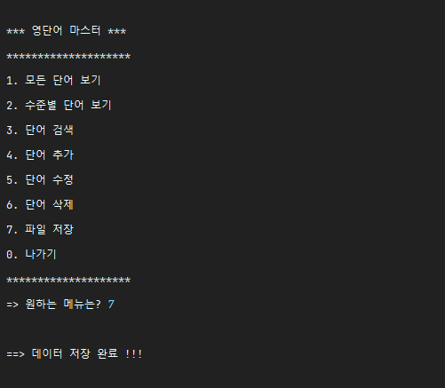
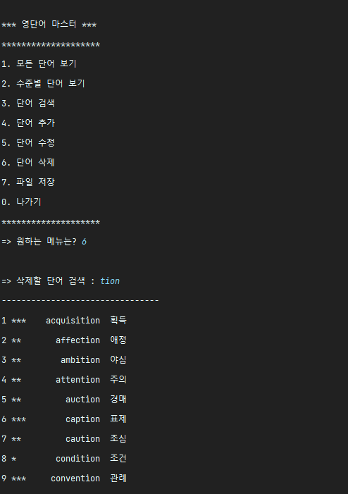
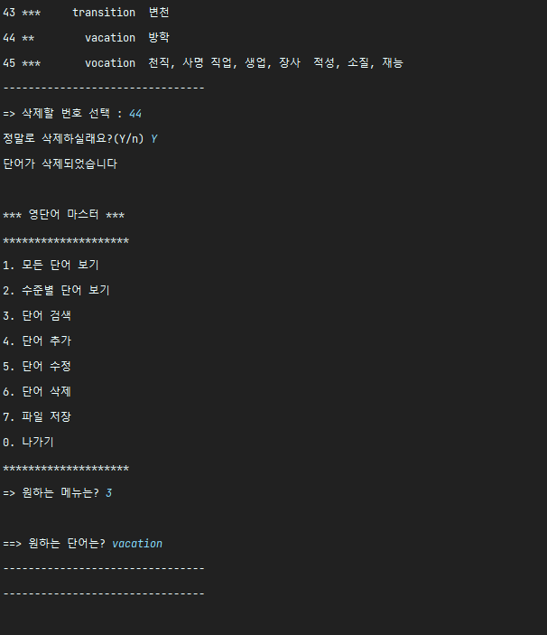
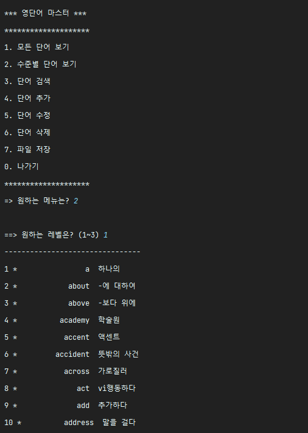
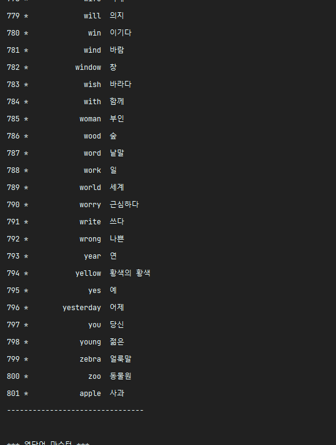
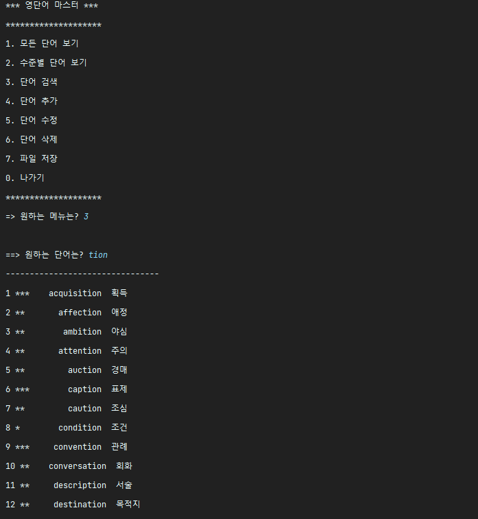
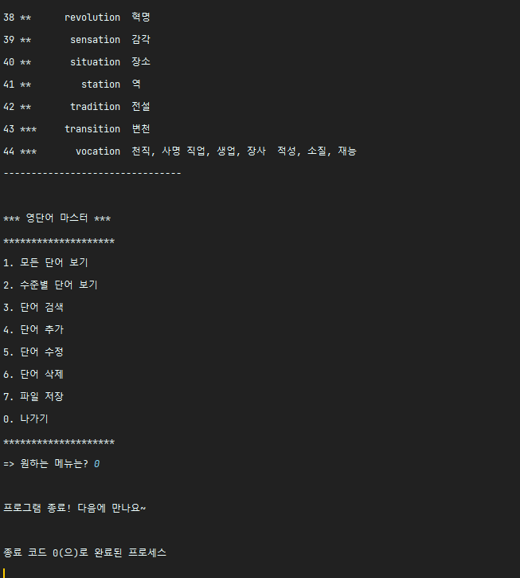

# 영어단어장 프로젝트 제작, Update, Delete, Search, File I/O 기능 구현하기

## 실행결과

### Update
file load완료 
tion 검색  

-단어가 너무 많아서 생략-  
44번 단어 수정

단어 변경 완료 

### FileSave

### Delete

-단어가 너무 많아서 생략-  
44번 vacation 삭제 완료 -> 단어 찾을 수 없음

### Search
  ## 모든 단어 검색

-단어가 너무 많아서 생략-  

## 난이도별 단어 검색

  -단어가 너무 많아서 생략-  

## 원하는 단어 검색 기능

### 종료

